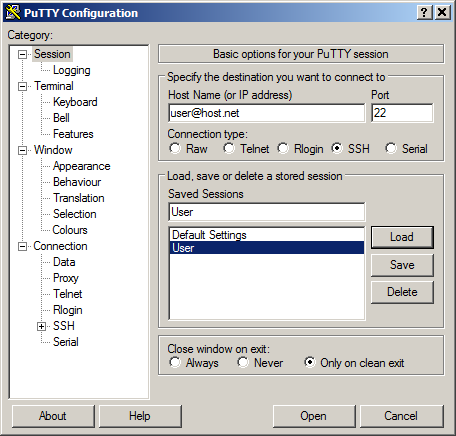

<!-- soft hyphen &shy; -->
# Secure Shell

Als Secure Shell werden sowohl die unter&shy;lagerten Protokolle, als auch die Programme die zusammen die Funktionalität der Secure Shell darstellen bezeichnet. Sie er&shy;möglichen den verschlüsselten Zugang zur Kommando&shy;zeile entfernter Rechner und den ebenfalls ver&shy;schlüsselten Daten&shy;transfer. Secure Shell wurde ursprünglich von dem Finnen Tatu Ylönen ent&shy;wickelt. Dessen kommerzielle Software von der Firma Tectia entwickelt wird. OpenSSH ist eine weit verbreitete quelloffene Variante die auch in diesem Dokument genutzt wird. Zu nennen ist noch die Secure Shell Variante namens Dropbear, deren Fokus auf ein&shy;ge&shy;betteten Systemen liegt.  
```bash
# Einwahl per Benutzername und Passwort
$ ssh user@host
```  
## Einwahl über Public-Key
Die Authen&shy;ti&shy;fizierung des Nutzers kann über verschiedene Wege geschehen, u. a. durch die Eingabe von Benutzer&shy;name und Passwort oder durch das Public-Key Verfahren. Letzteres bietet neben einer sicheren Einwahl ebenfalls den Komfort der passwort&shy;losen Einwahl. Im weiteren wird die Ein&shy;richtung und Nutzung des Public-Key Verfahrens beschrieben.
Um eine passwort&shy;lose Einwahl mit Hilfe von Public-Keys zu ermöglichen müssen folgende Schritte durch&shy;laufen werden.

1. Erzeugung des Schlüssel&shy;paars (Private-Key und Public-Key).
1. Übertragen des Public-Keys auf den ent&shy;fernten Rechner (eintragen in die SSH-Konfigurations&shy;datei).
1. Anpassen der Zugriffsrechte für die Konfigurationsdatei.
1. Testen der Verbindung. 

Es ist darauf zu achten, dass der Private-Key mittels Zugriffsrechten versehen und vor fremdem Zugriff geschützt werden muss. Der Public-Key kann und muss jedoch frei verteilt werden. Es ist ratsam den Datei&shy;namen zu definieren. Zum einen sorgt dies für eine einfache Zu&shy;ordnung von Schlüsseldateien zu Verbindungs&shy;partnern und zum anderen wird damit vermieden versehentlich falsche Schlüssel zu über&shy;tragen. Das Übertragen des Public-Keys auf den entfernten Rechner. Dabei wird der öffentliche Schlüssel des Nutzers in die Datei `~/.ssh/authorized_keys` kopiert bzw. angehängt. Der Befehl `ssh-copy-id` ist keine ausführbare Datei, sondern ein Shell-Skript. Er steht somit nur unter Linux zur Verfügung. Die Namens&shy;konvention von OpenSSH versieht den öffentlichen Schlüssel mit einer Endung, den privaten jedoch nicht (public `file.pub`, privat `file`). 

> Der Private-Key wird nie übertragen, er verbleibt auf dem Rechner von dem aus die Einwahl initiiert wird.

Hier eine Beispielsitzung auf dem lokalen Rechner inklusive des Erstellens der Konfigurations&shy;datei für die Nutzung des Schnell&shy;zugriffs:   
Erzeugen eines neuen Verzeichnisses:  
`$ cd ~ && mkdir .ssh && cd $_`  
Schlüsselpaar (Private-Key und Public-Key) erzeugen:  
`$ ssh-keygen -f key`  
Kopieren des Public-Key auf den entfernten Rechner:  
`$ ssh-copy-id -i ~/.ssh/key.pub user@host.org`  
Erzeugen einer Konfigurationsdatei:  
`$ touch config`  
Setzen der Rechte der Konfigurationsdatei:  
`$ chmod 600 config`  

## Schnellzugriff per Konsole
Um einen Schnellzugriff auf SSH-Verbind&shy;ungen aus der Konsole heraus zu ermöglichen sind folgende Schritte erforderlich. Erstens Anlegen der Datei `~/.ssh/config`. Zweitens kopieren des unten stehenden Inhalts in diese Datei. Danach lässt sich eine OpenSSH-Verbind&shy;ung in der Konsole über die Eingabe von `ssh shortcut` aufbauen.
```
### ~/.ssh/config ###
Host shortcut
  HostName host.net
  Compression yes
  User user
  IdentityFile ~/.ssh/prk_file
```

## Public-Key Schlüsselformate
Mit Hilfe eines Schlüsselspaars lässt sich die Einwahl auf mehrere entfernte Rechner realisieren. Es ist jedoch ratsam für jeden entfernten Rechner ein eigenes Schlüsselpaar anzulegen um ein das entfernen und hinzu&shy;fügen einzelner Schlüssels zu er&shy;mögli&shy;chen. Es existieren zwei verbreitete Formate für Schlüssel. Zum einen das von Tectia über&shy;nommene SSH2-Format (wird von PuTTY genutzt) und das OpenSSH-Format. Soll exemplarisch ein Schlüssel der unter PuTTY erzeugt wurde auf einem Linux-Rechner verwendet werden, so muss zuvor vom  SSH2-Format in das OpenSSH-Format ge&shy;wandelt werden.  
Wandlung vom SSH2-Format in OpenSSH-Format:  
`$ ssh-keygen -i -f ssh2.pub > openssh.pub`  
Wandlung vom OpenSSH-Format in SSH2-Format:  
`$ ssh-keygen -e -f openssh.pub > ssh2.pub`  

## Wahl des Verschlüsselungsverfahrens
Die Auswahl spezifischer Verschlüsselungs&shy;verfahren geschieht über den Schalter `-c`, nicht mit `-C` für das aktivieren der Kompression zu verwechseln. Bei der Auswahl eines nicht unterstützten Verfahrens wird eine Liste der möglichen Verfahren ausgegeben: `ssh -c aes128-ctr user@host`
Die Ausgabe der unterstützten Verschlüssel&shy;ungs&shy;verfahren (seit Version v6.3) lässt sich über `ssh -Q cipher` ausgeben. Zur Fehler&shy;suche lassen sich detaillierte Informationen über `ssh -v` anzeigen. Die Ausgabe der OpenSSH-Version geschieht per `ssh -V`.

## Unterbrechnung einer OpenSSH-Verbindung
Um bei einer bestehenden OpenSSH-Verbindung einen Befehl auf der lokalen Kommando&shy;zeile ausführen zu können kann die Verbindung mittels `[Return]~[Strg]+'z'` in den Hinter&shy;grund gesetzt werden. Die übliche Eingabe von `[Strg]+'+'` ist nicht aus&shy;rei&shy;chend, da alle Eingaben an den entfernten Rechner weitergeleitet werden. Durch Verwendung des Escape-Zeichens `[Return]~` lässt sich dies umgehen. So lässt sich die OpenSSH-Verbindung wie bei lokalen Kommandos üblich in den Hintergrund versetzen und steht unter der Job-Kontrolle. Durch Eingabe von `fg` lässt sich die Verbindung wieder in den Vordergrund holen. 

## SSH-Alternative für Verbindungen über roaming
Die mosh (mobile shell) ermöglicht roaming und handover von bestehenden Verbind&shy;ungen. Somit ist es möglich eine Einwahl zwischen ver&shy;schiede&shy;nen Verbind&shy;ungs&shy;arten (GSM, LTE, WLAN) und der Nutzung des Ruhemodus des Rechners ohne Ver&shy;bindungs&shy;abbruch zu nutzen. Weiterhin ist der im Vergleich zu SSH niedrigere Bandbreitenbedarf und eine verbesserte Latenz zu nennen. Dies ist möglich, da mosh UDP (connection-less) anstelle von TCP (connection-oriented) verwendet, dadurch entfällt das Handshake. Des weiteren verwendet mosh ein lokales Echo (Eingaben werden soweit möglich lokal dargestellt ohne übertragen zu werden) und es werden Verfahren genutzt, die ähnlich zu diff und patch arbeiten. Daher muss nicht der gesamt Bildschirminhalt bei einer Änderung übertragen werden.

## Einstellungen für PuTTY
PuTTY ist ein unter Microsoft Windows ver&shy;brei&shy;teter SSH-Client, es beinhaltet SCP (`pscp.exe`), SFTP (`psftp.exe`) und einen Agent (`pageant.exe`). Mit `plink.exe` steht eine Kommando&shy;zeilenversion des PuTTY-Clients zur Verfügung, somit ist es von der CLI als auch der GUI nutzbar.

Start von PuTTY mit einer gespeicherten Session:  
`putty.exe -load "Session Name"`  
Start von Pageant mit privaten Schlüsseln:  
`pageant.exe C:\private1.ppk C:\private2.ppk`
<!--    -->
<!--  -->

## Todo
1. Nachvollziehen der Beschreibung
1. `ssh-keygen -R` zum löschen von Schlüseln
1. Überprüfung des angezeigten Serverschhüssels
1. Deaktivieren der Einwahl per Passwort auf dem sshd
1. Neustart des sshd auf Ubuntu
1. Dateien kopieren mittels `scp`
1. Test offener Ports mittels telnet
   ```
   telnet <host> 22
   -
   SSH-2.0-OpenSSH_8.0
   -
   Strg+'+'
   -
   quit
   ```
1. Verwendung des Agents `eval $(ssh-agent)`
1. 
